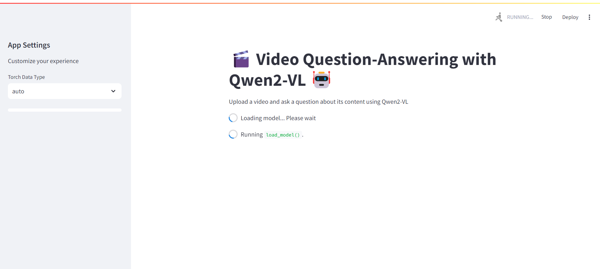
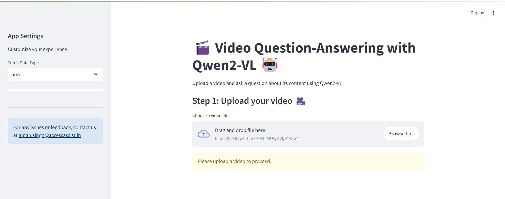
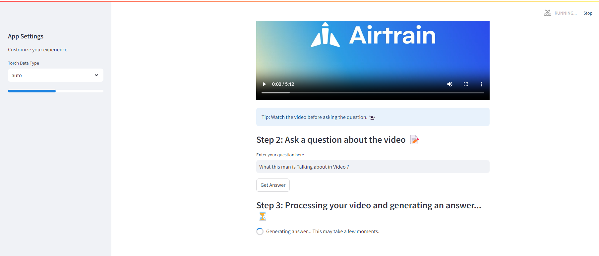

🎬 Video Question-Answering App using Qwen2-VL 🤖
This Streamlit app allows users to upload a video and ask questions about the content using the powerful Qwen2-VL-7B-Instruct model. It provides an interactive interface where users can upload videos, input questions, and receive AI-generated answers related to the video.

Features
Upload Video: Upload videos in formats like .mp4, .mov, and .avi.
Ask Questions: Input any question related to the uploaded video, and the model will generate an answer based on the video content.
Progress Feedback: Real-time progress bar and spinner during video processing and model inference.
Customizable Settings: Options to configure model settings via a user-friendly sidebar.
Error Handling: Gracefully handles errors with informative messages and logs.
Interactive UI: Intuitive design with clear step-by-step instructions and feedback for better user experience.

# Demo of App






# Getting Started

1. Clone The Repository

```bash
    git clone https://github.com/your-repo/video-question-answering-app.git
```
2. Create New Python Environment & Activate

```bash
   virtualenv <your environment>
   source <your environment>/bin/activate
```
3. Install Dependencies

```bash
   pip install -r requirements.txt
```

4. Run APP

To launch the Streamlit app, run the following command in your terminal:
```bash
   streamlit run app.py
```

